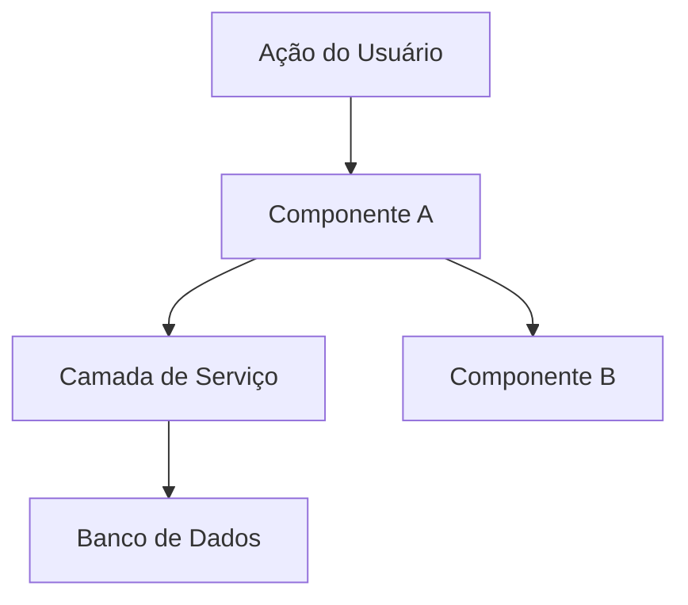

# Design

**Goal**: Define HOW to build it. Architecture, components, what to reuse.

**Skip this phase when:** The change is straightforward — no architectural decisions, no new patterns, no component interactions to plan. For simple features, design happens inline during Execute.

## Process

### 1. Load Context (OBRIGATÓRIO)

Antes de projetar, **carregar nesta ordem**:

1. `.specs/features/YYYY-MM-DD-[feature]/spec.md` — sempre
2. `.specs/features/YYYY-MM-DD-[feature]/context.md` — **OBRIGATÓRIO se existir**

**`context.md` contém as decisões aprovadas no discovery do Specify** (abordagem escolhida entre as 2-3 propostas, trade-offs aceitos, restrições do dev). Essas decisões são **constraints do design** — não reoptar, não propor padrão contrário ao que já foi travado.

Se uma decisão em `context.md` parece arquiteturalmente incorreta agora que você está projetando, **escalar ao dev** com proposta de revisão — nunca ignorar silenciosamente.

Decisões marcadas como "Agent's Discretion" em `context.md` são suas para decidir.

⚠️ **Pular esta seção = projetar contra constraint aprovado = retrabalho garantido na fase Tasks.**

### 1.5. Research (Optional but Recommended)

If the feature involves unfamiliar technology, patterns, or integrations, research before designing. Document findings briefly in the design doc or as inline notes. This prevents incorrect assumptions from propagating into tasks.

Follow the **Knowledge Verification Chain** (see SKILL.md) in strict order:

```
Codebase → Project docs → Context7 MCP → Web search → Flag as uncertain
```

**CRITICAL: NEVER assume or fabricate information.** If you cannot find an answer through the chain, explicitly say "I don't know" or "I couldn't find documentation for this". Inventing an API, a pattern, or a behavior that doesn't exist is far worse than admitting uncertainty. Wrong assumptions propagate through design → tasks → implementation and cause cascading failures.

Good triggers for research: new libraries, unfamiliar APIs, performance-sensitive features, security-sensitive features, patterns you haven't used in this codebase before.

### 2. Define Architecture

Overview of how components interact. Use mermaid diagrams when helpful. Before creating any diagrams, check if the `mermaid-studio` skill is available (see Skill Integrations in SKILL.md).

Propor 2-3 abordagens arquiteturais com trade-offs claros e recomendação (mesmo processo de discovery do [specify.md](../specify/specify.md)). Apresentar o design incrementalmente por seção, com aprovação do dev entre seções. Só avançar para a próxima seção após confirmação.

### 3. Identify Code Reuse

**CRITICAL**: What existing code can we leverage? This saves tokens and reduces errors.

If `.specs/codebase/CONCERNS.md` exists, check it before designing. Any component flagged as fragile, carrying tech debt, or having test coverage gaps requires extra care in the design — document how the design mitigates those concerns.

#### Reuse Validation Checklist (OBRIGATÓRIO antes de avançar)

Antes de fechar o `design.md`, percorrer o checklist e **registrar o resultado no próprio doc** como bloco auditável:

```markdown
## Reuse Validation

**Componentes reusáveis identificados:**
- `src/path/X` — papel: Y — usado em: T1, T2
- `src/path/A` — papel: B — usado em: T3
- (...)

**Padrões reusáveis identificados:**
- Padrão `ResultObject` (de `src/shared/`) — aplicado em: response do novo endpoint
- (...)

**Áreas exploradas SEM reuso (justificativa):**
- Auth flow custom — incompatível com `src/auth/legacy` (depende de session estática)
- (...)

**Áreas NÃO exploradas** (riscam reuso posterior na fase Tasks):
- [marcar como vazio se nada falta, OU listar] 
```

**Por que isso fica no `design.md`:** Tasks vai descobrir reusos "esquecidos" e retroceder ao Design. O checklist fecha o loop — se "áreas não exploradas" estiver vazio, Tasks tem licença para prosseguir; se tiver itens, são red flags conhecidas.

**Sinais de "explorei o suficiente":**
- Você procurou em `src/shared/`, `src/utils/`, `src/components/common/` (ou equivalente da stack)
- Você verificou se `CONVENTIONS.md` documenta padrões aplicáveis
- Você consultou pelo menos 1 feature similar prévia em `.specs/features/`

### 4. Define Components and Interfaces

Each component: Purpose, Location, Interfaces, Dependencies, What it reuses.

### 5. Define Data Models

If the feature involves data, define models before implementation.

### 6. Design Review (obrigatório)

Após gerar o design.md, o agente apresenta seção por seção ao dev para validação interativa:

- Apresentar cada seção do design.md individualmente, aguardando aprovação antes de avançar
- Para features Large/Complex: executar spec self-review nos critérios de consistência, completude e ambiguidade
- Corrigir problemas identificados antes de prosseguir para Tasks

---

## Template: `.specs/features/YYYY-MM-DD-[feature]/design.md`

**IMPORTANTE:** Este template é um esqueleto stack-agnostic. O agente DEVE:
- Escrever no **idioma do projeto** (detectado do CLAUDE.md)
- Usar **paths reais** do projeto (não `src/path/to/file`)
- Exemplos de código e interfaces na **linguagem do projeto**
- Modelos de dados no **formato do projeto** (Eloquent model, migration, etc.)

````markdown
# [Feature] — Design

**Spec**: `.specs/features/YYYY-MM-DD-[feature]/spec.md`
**Status**: Draft | Approved

---

## Visão Geral da Arquitetura

[Descrição breve da abordagem arquitetural]


````

---

## Análise de Reuso

### Componentes Existentes

| Componente           | Localização                  | Como Usar                 |
| -------------------- | ---------------------------- | ------------------------- |
| [Componente]         | `app/[app]/path/to/file`     | [Estender/Importar/Ref]   |
| [Utilitário]         | `app/[app]/path/to/file`     | [Como ajuda]              |

### Pontos de Integração

| Sistema        | Método de Integração                    |
| -------------- | --------------------------------------- |
| [API existente]| [Como a feature se conecta]             |
| [Banco]        | [Como os dados se conectam]             |

---

## Componentes

### [Nome do Componente]

- **Propósito**: [O que faz — uma frase]
- **Localização**: `app/[app]/path/to/component`
- **Interface pública**:
  - `nomeMetodo(param): retorno` — [descrição]
- **Dependências**: [O que precisa para funcionar]
- **Reusa**: [Código existente que aproveita]

---

## Modelos de Dados (se aplicável)

[Descrever usando o formato da stack do projeto. Exemplos por stack:]

**Para projetos Laravel:**
```
Tabela: nome_tabela
- id (bigint, PK)
- campo1 (varchar)
- campo2 (integer)
- created_at, updated_at (timestamps)

Relacionamentos: belongsTo(OutroModel), hasMany(RelatedModel)
```

**Para projetos TypeScript:**
```typescript
interface NomeModel {
  id: string
  campo1: string
  campo2: number
}
```

**Para outros:** usar formato nativo da stack detectada.

---

## Tratamento de Erros

| Cenário        | Tratamento    | Impacto no Usuário |
| -------------- | ------------- | ------------------ |
| [Cenário 1]    | [Como tratar] | [O que o user vê]  |

---

## Decisões Técnicas (apenas não-óbvias)

| Decisão           | Escolha         | Justificativa |
| ----------------- | --------------- | ------------- |
| [O que decidimos] | [O que escolhemos] | [Por quê]  |

---

## Tips

- **Load context first** — If context.md exists, decisions there are locked
- **Research when uncertain** — 5 minutes of research prevents hours of rework
- **Reuse is king** — Every component should reference existing patterns
- **Interfaces first** — Define contracts before implementation
- **Keep it visual** — Diagrams save 1000 words (check mermaid-studio skill in Skill Integrations)
- **Small components** — If component does 3+ things, split it
- **Check CONCERNS.md** — If it exists, flag fragile areas the design must address
- **Confirm before Tasks** — User approves design before breaking into tasks
- **Alternativas** — SEMPRE propor pelo menos 2 abordagens com trade-offs claros. Liderar com a recomendada. Dev escolhe.
